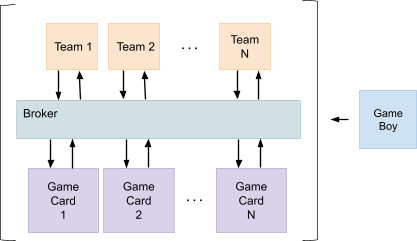
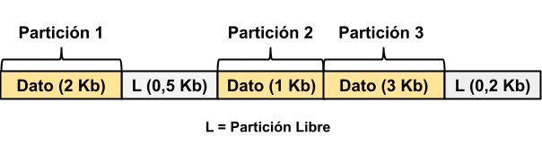
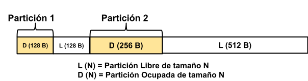
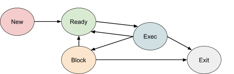

[Back to main README](../README.md)


**Abstract**

The objective of this project is to develop a solution that allows the simulation of a distributed system using the concept of Message Queues.

The components included within the system architecture must work together for the planning and execution of various operations, such as reading and writing values. The operations that make up these messages are associated and linked to the world of Pokémon.

Message Queue (hereafter referred to as MQ) is a software technique used for inter-process communication (IPC) based on the concept of Queues. In this technique, different processes leave messages, and others read them asynchronously. This allows for the development of a fully distributed, scalable, and independent system.

The system components will be:

- A publisher process that inputs messages into the system (Game Boy).
- A Message Queue administrator process (Broker).
- Processes that retrieve messages and perform planning based on them (Team).
- Filesystem processes responsible for maintaining files over time (Game Card).

**System Architecture**

As we said before, the system consists of 4 modules
independent which interact with each other as shown in the
next diagram.



The Game Boy will be our starting point and, at the same time, it will know and allow the sending of messages to different modules of our system.

The Broker process will be responsible for managing the different Message Queues existing in the system. To do this, it will maintain various characteristics and functionalities of a real Message Queue system, taking care of maintaining, understanding, and distributing the different messages.

The Team process will contain a list of trainers with different Pokemon capture objectives. Our process must plan the trainers correctly so that they cooperatively fulfill their objectives within a map. In this way, the Pokemon will be resources that the different trainers must capture by moving around the map (taking possession), and then exchange them if necessary (in case of a deadlock).

Finally, our Game Card process will be responsible for knowing which Pokemon are available within the map and their respective positions. It must maintain different permissions and attributes so that only one process can access it at a time. As this process is connected to the Broker and associated with a specific message queue, it allows us to generate redundancy for the Game Card and replicate the same files with different delays or different file systems.


**Broker Process**

It will be responsible for managing the message queues of our system. As such, it will have the following responsibilities:

1. Manage the subscribers (Teams, Game Cards) associated with the different queues.
2. Manage the reception, sending, and acknowledgment of all messages to multiple subscribers.
3. Keep a record of the last received messages from the specified queues for future subscribers.
4. Maintain and provide real-time information on the states of the queues, including their messages and subscribers.

To explain this, let's first focus on the technical concept of what a Message Queue (MQ) is and then address the technical aspects and guidelines of our implementation.

**Abstract - Message Queue (MQ)**

Message queues are software that enables asynchronous inter-process communication (IPC). This means that the message sender and receiver do not need to interact with the message queue at the same time.

Each message placed in a queue is stored until the recipient(s) retrieve and/or read them. Message queues have implicit or explicit limits on the size of data that can be transmitted in a single message and the number of pending messages that can be held in the queue.

In this way, we will have several processes that will act as publishers, responsible for placing messages in a specific message queue, while other processes will act as subscribers, receiving messages that arrive in the message queues they are subscribed to.


In the scope of our practical work, we will implement a series of message queues that we will use for various purposes, which we will explain later. These message queues must comply with the following technical aspects:

1. Durability: Every message must remain in the message queue until all Subscribers receive it.

2. Receipt notification: Every delivered message must be acknowledged by each Subscriber to mark it and prevent it from being sent again to the same Subscriber.

3. Maintainability: Each message queue must maintain its state and delete messages that have been evicted from the cache by the replacement algorithm.

4. Asynchronicity: The reception and notification of messages can occur at different times. They should not be immediately notified to the components subscribed to the queue.

**Guidelines and Implementation**

As previously mentioned, the Broker is responsible for managing the message queues in our system, simulating certain technical aspects of real-world implementations. Additionally, concepts from the course such as memory management, messaging, and synchronization are incorporated.

The main functionality of the Broker is to manage the different message queues with their respective subscribers. To do this, it will wait for requests from different modules to associate themselves with the queues it manages. Therefore, each client/module must communicate with the Broker indicating which queue they wish to subscribe to (at this point, we will refer to the other module as a subscriber).

Once this information is provided, the Broker will maintain a list of subscribers for each queue it manages. At a later time, a message will arrive with the destination being one of these message queues, and the Broker will distribute the message to the subscribers (sending the message to each of them). When doing this, the following points must be taken into account:

Every message must be cached within the Broker's internal memory.

Every message must know which subscribers it was sent to and whether it was received (confirmation, ACK or acknowledgement).

Every message must have a unique identifier generated by the Broker, which must be communicated to the module that generated the message.

This functionality must be implemented using multi-threading. This architecture will allow the Broker to send and transact messages simultaneously to the different subscribers. Any other implementation that does not adhere to this concept will result in the disapproval of the practical work.

Message Management
As previously mentioned, the Broker will maintain an internal memory where the latest received messages from the different message queues are cached. In this memory, the Broker must record:

1. Unique identifier of the message within the system. The message type (which message queue it belongs to).
2. The subscribers to whom the message has already been sent.
3. The subscribers who have returned the ACK (acknowledgment) for the message.

Two Memory Management schemes will be implemented: Dynamic Partitions with Compaction and the Buddy System (described later). The active scheme at cache startup will be chosen by a configuration file. For both schemes, the minimum partition size and a maximum size (which will be the size of the entire memory) will be defined as parameters for the Broker.

One mandatory requirement for the Broker is that once it is initialized, no more dynamic memory can be allocated to store data. Therefore, all the memory needed for data storage must be dynamically pre-allocated at the beginning. Only the content of the message should be stored in the data portion, while the type, identifier, and other flags of the message should be kept in auxiliary structures.

Each time a process subscribes to a message queue, it should receive all the cached messages from that message queue.

**Dynamic Partitions with Compaction**

In this scheme, a memory portion of the exact size of the stored value will be reserved for each value. This means that the number of partitions and their sizes will vary. For example:




In the above example, if a new value of 0.2 KB is stored in the space of the first free partition, a new "Partition 4" of 0.2 KB will be created, and a new free partition of 0.3 KB will remain next to it.

[Procedure for data storage]
1. Search for a free partition that has enough contiguous memory to contain the value. If one is not found, proceed to the next step (if applicable; otherwise, skip directly to step 3).
2. Compact the memory and perform a new search. If one is not found, proceed to the next step.
3. Delete a data partition. Then, if a partition with enough memory to contain the value still cannot be found, go back to step 2 or step 3, depending on the case.

**Algorithms for Free Partition Selection and Victim Selection**

To select a free partition, the following pairs of algorithms should be implemented:

- First Fit and Best Fit

When it comes to deleting a partition, the algorithms to be implemented are:

- FIFO (First In First Out) and LRU (Least Recently Used).

In both cases, the algorithm to be used will be defined by the configuration file.

**Buddy System**
In this scheme, a memory partition of a power of 2 size closest to the stored value will be reserved for each value. For example:



In the above example, if a new value of 63 B is stored in the space of the first free partition, a new "Partition 3" of 64 B will be created, and a new free partition of 64 B will remain next to it.

The data storage procedure will be similar to that of dynamic partitions, with the exception that compaction does not exist in the Buddy System algorithm. FIFO and LRU will be the victim selection algorithms to be implemented for replacement (similarly to the previous algorithm, modifiable through the configuration file).

**Cache Dump**
The memory management engine should be able to deposit the current state of the memory in the cache into a file according to the selected scheme. To request this dump, a SIGUSR1 signal will be sent and should be handled and initialized.

The purpose is not to view the content of the stored

 information, but rather to display the assigned/free partitions, indicating their start and end addresses, their size in bytes, LRU times, the type of message queue they belong to, and their identifier.

[Example:]

\-\-\-\-\-\-\-\-\-\-\-\-\-\-\-\-\-\-\-\-\-\-\-\-\-\-\-\-\-\-\-\-\-\-\-\-\-\-\-\-\-\-\-\-\-\-\-\-\-\-\-\-\-\-\-\-\-\-\-\-\-\-\-\-\-\-\-\-\-\-\-\-\-\-\-\-\-\-\-\-\-\-\-\-\-\-\-\-\-\-\-\-\-\-\-\-\-\-\-\-\-\-\-\-\-\-\-

Dump:
14/07/2012 10:11:12

| Partition |     | Size |    |     |
|-----------|-----|------|----|-----|
| Partition 1:  0x000 -   0x3FF.    |   [X]            |   Size: 1024b          | LRU:<VALUE>| la:<QUEUE> ID:<ID>|
| Partition 2: 0x400 0x409. | [L]       | Size: 9b  |             |             |
| Partition 3: 0x40A 0x40B | [L]       | Size: 1b  |             |             |

\-\-\-\-\-\-\-\-\-\-\-\-\-\-\-\-\-\-\-\-\-\-\-\-\-\-\-\-\-\-\-\-\-\-\-\-\-\-\-\-\-\-\-\-\-\-\-\-\-\-\-\-\-\-\-\-\-\-\-\-\-\-\-\-\-\-\-\-\-\-\-\-\-\-\-\-\-\-\-\-\-\-\-\-\-\-\-\-\-\-\-\-\-\-\-\-\-\-\-\-\-\-\-\-\-\-\-

1. Connection of a process to the broker.
2. Subscription of a process to a message queue.
3. Arrival of a new message to a message queue.
4. Sending a message to a specific subscriber.
5. Confirmation of receipt from a subscriber for a previous message sent.
6. Storage of a message within memory (indicating the starting position of its partition).
7. Deletion of a memory partition (indicating its starting position).
8. Execution of compaction (for dynamic partitions) or block association (for the buddy system). In the latter case, indicate which partitions were associated (indicating the starting position of both partitions).
9. Execution of a cache dump (only indicate that the request was made).


**Game Card Process**

This module will allow us to **implement our own file storage** to store data of different Pokemon found in the map. To achieve this, we need to implement the TALL_GRASS FileSystem as explained in the following sections.

This process will communicate with others in two possible ways:

1. Through a connection to the Broker by globally associating with the NEW_POKEMON, CATCH_POKEMON, and GET_POKEMON message queues.
2. Through a listening socket where it can receive messages from the aforementioned message queues.

It should be noted that the Game Card Process should be able to run without establishing a connection with the Broker. In other words, if the Broker is not running or crashes during execution, the Game Card Process should continue processing its functions without it.

If the connection fails or is lost, the Game Card Process should have a reconnection system that retries the connection every X seconds, which can be configured through a configuration file. This allows the Broker to be restarted later, and the Game Card Process can associate with the message queues without the need to restart itself.

**Tall Grass**

The Tall Grass FileSystem is a component created for educational purposes to help students understand the basic functioning of file management in an operating system.

The basic structure of the Tall Grass FileSystem is based on a directory tree structure to represent administrative information and entity/Pokemon data in the form of files. The directory tree will start from the mount point specified in the configuration file.

During testing, no files with inconsistent states related to the practical work will be provided, so it is not necessary to consider such cases.

**Metadata**\
This file will contain information about the number and size of blocks in the File System.

The following fields will be found within the file:

- **Block_size**: Indicates the size in bytes of each block.
- **Blocks**: Indicates the number of blocks in the File System.
- **Magic_Number**: A fixed string with the value "TALL_GRASS".

Example:

BLOCK_SIZE=64
BLOCKS=5192

MAGIC_NUMBER=TALL_GRASS

This file should be located at the path [Mount_Point]/Metadata/Metadata.bin

**Bitmap**

This will be a binary file containing a bitmap that represents the status of blocks within the FileSystem. A value of 1 indicates that the block is occupied, while a value of 0 indicates that the block is free.

The path of the bitmap file is: [Mount_Point]/Metadata/Bitmap.bin

**Files Metadata**
The files within the FileSystem will be located in a path structured as follows: [Mount_Point]/Files/[File_Name]

The file path includes the Metadata file.

Example:

/mnt/TALL_GRASS/Files/Pikachu/Metadata.bin

The Metadata.bin file will contain the following fields:

- **Directory**: Indicates whether the file is a directory or not (Y/N).
- **Size**: Indicates the actual size of the file in bytes (if it is not a directory).
- **Blocks**: An array of numbers that indicates the order of the blocks where the actual data of the file is stored (if it is not a directory).
- **Open**: Indicates whether the file is currently open (Y/N).

Example for a directory:

DIRECTORY=Y

Example for a file:

DIRECTORY=N
SIZE=250
BLOCKS=[40,21,82,3]
OPEN=Y

This way, we can form the following file tree where the metadata inside the Files directory has a DIRECTORY with a value of Y, and Pikachu has a metadata file with a DIRECTORY value of N.

/mnt/TALL_GRASS/Files/Metadata.bin

/mnt/TALL_GRASS/Files/Pikachu/Metadata.bin

**Data**

The data will be distributed across text

 files named with a number, which represents the block number (e.g., 1.bin, 2.bin, 3.bin).

It is recommended to investigate the handling of bit arrays using the commons library.

These files will be located within the path: [Mount_Point]/Blocks/[blockNumber].bin

Example:

/mnt/TALL_GRASS/Blocks/1.bin

/mnt/TALL_GRASS/Blocks/2.bin

**Guidelines and Implementation**

This process will manage a FileSystem that will be read and interpreted as a directory tree and its files using the Tall Grass FileSystem.

Upon starting the Game Card process, it will attempt to subscribe globally to the following message queues in the Broker:

- NEW_POKEMON
- CATCH_POKEMON
- GET_POKEMON

When subscribing to each of these queues, it should wait to receive a message from the Broker. Upon receiving a message from any thread, the Game Card Process should:

1. Inform the Broker of the message reception (ACK).
2. Create a thread to handle the request.
3. Resume listening for new messages from the respective message queue.

Every file within the file system will have an "OPEN" value in its metadata, indicating if any process is currently using the file. ***Under no circumstances should two processes be allowed to open the same file simultaneously***. If this happens, the relevant error should be reported through the log file or console, and the operation should be retried after a defined time specified in the configuration file.

**Pokemon Files**\
Each Pokemon file will internally contain a list of positions in the map with their respective quantities per position. For example:

1-1=10
1-5=1
3-1=2
7-6=1000

The inclusion or deletion of a new line depends on the reception of different messages from the Broker.

Next, we will explain the operations to be performed upon receiving messages from any of these message queues.


**New Pokemon**\
This message will add the appearance of a new Pokemon to the map. It will have four input parameters:

1. ID of the received message.
2. Pokemon to add.
3. Map position.
4. Quantity of Pokemon at the given position to add.

Upon receiving this message, the following operations should be performed:

1. Verify if the Pokemon exists within our Filesystem. To do this, search within the Pokemon directory for a file with the name of our Pokemon. If it doesn't exist, create it.

2. Check if the file can be opened (if no other process is currently using it). If the file is open, retry the operation after a time defined in the configuration file.

3. Verify if the positions already exist within the file. If they exist, add the quantity passed as a parameter to the current quantity. If they don't exist, add a new line at the end of the file indicating the quantity of the passed Pokemon.

4. Wait for the number of seconds defined in the configuration file.

5. Close the file.

6. Connect to the Broker and send the message to the ***APPEARED_POKEMON*** message queue with the following data:
   - ID of the received message.
   - Pokemon.
   - Map position.

If the connection to the Broker cannot be established, report it in the logs and continue the execution.

**Catch Pokemon**\
This message will indicate if it's possible to catch a Pokemon and capture it if possible. The following parameters will be received:

1. ID of the received message.
2. Pokemon to catch.
3. Map position.

Upon receiving this message, the following operations should be performed:

1. Verify if the Pokemon exists within our Filesystem. To do this, search within the Pokemon directory for a file with the name of our Pokemon. If it doesn't exist, report an error.

2. Check if the file can be opened (if no other process is currently using it). If the file is open, retry the operation after a time defined in the configuration file.

3. Verify if the positions already exist within the file. If they don't exist, report an error.

4. If the Pokemon quantity is "1", delete the line. Otherwise, decrement the quantity by one.

5. Wait for the number of seconds defined in the configuration file.

6. Close the file.

7. Connect to the Broker and send a message indicating the correct result.

Every result, whether correct or not, should be sent by connecting to the Broker and sending a message to the ***CAUGHT_POKEMON*** message queue indicating:

1. ID of the original received message.
2. Result.

If the connection to the Broker cannot be established, report it in the logs and continue the execution.

**Get Pokemon**\
This message will retrieve all positions and their quantities of a specific Pokemon. It will receive:

1. ID of the received message.
2. Pokemon to retrieve.

Upon receiving this message, the following operations should be performed:

1. Verify if the Pokemon exists within our Filesystem. To do this, search within the Pokemon directory for a file with the name of our Pokemon. If it doesn't exist, inform the message without positions or quantities.

2. Check if the file can be opened (if no other process is currently using it). If the file is open, retry the operation after a time defined in the configuration file.

3. Retrieve all positions and quantities of the requested Pokemon.

4. Wait for the number of seconds defined in the configuration file.

5. Close the file.

6. Connect to the Broker and send the message with all positions and their quantities.

If there is at least one position for the requested Pokemon, send a message to the Broker at the ***

LOCALIZED_POKEMON*** message queue indicating:

3. ID of the originally received message.
4. The requested Pokemon.
5. The list of positions and the quantity of X and Y positions for each of them on the map.

If the connection to the Broker cannot be established, report it in the logs and continue the execution.

**Team Process**

This process will be responsible for managing different trainers and "planning" them within a two-dimensional map. Each trainer will have specific goals to catch different Pokémon, which will be configured through configuration files. It should be noted that a trainer cannot catch more Pokémon than specified in their objective. For example, if their objective is to catch three Pokémon, they cannot catch more than three, even if they are not the specific ones they need.

**Guidelines and Implementation**

The objective of this process is to monitor the appearance of a new Pokémon and, if any trainer requires that Pokémon to fulfill their goal, plan the nearest available trainer to move to the position and catch it. This process will communicate in two possible ways:

1. Through the connection with the Broker by globally subscribing to the APPEARED_POKEMON, LOCALIZED_POKEMON, and CAUGHT_POKEMON message queues.

2. Through a listening socket where it can receive Pokémon appearance messages.

It should be noted that the Team Process should be able to run without establishing a connection with the Broker. If the Broker is not functioning or crashes during execution, the Team Process should continue processing its functions without it. For this purpose, default functions will be available for messages that the Team Process directly sends to the Broker.

If the connection cannot be established or it is lost, the Team Process should have a reconnection system that attempts to reconnect every X seconds, as configured in the configuration file.

**Scheduling**

As mentioned earlier, the different trainers are configured through a configuration file. Upon starting the process, a thread should be created for each existing trainer, and the Team process should know which Pokémon species and how many of each species are required in total to achieve the overall goal.

A Team process is considered to have achieved its overall goal when all its trainers have obtained the required Pokémon. Once the goal is reached, it should be reported through a log file and displayed on the screen, and the process should terminate. Unlike in theory, this termination will not release the acquired resources (Pokémon).

When a Pokémon appears (through either of the two methods explained earlier), only one trainer can be planned to move to that position, regardless of how many Pokémon of that species are present in that position.

To plan a trainer, the thread of the nearest trainer to the Pokémon will be selected. Each movement on the map corresponds to a CPU cycle, and diagonal movements will not be performed to reach the desired position. To simulate a more realistic behavior, a delay of X seconds should be added, which can be configured through the configuration file.

To plan the different trainers, the FIFO, Round Robin, and Shortest Job First scheduling algorithms with and without preemption will be used. For the latter algorithm, the next burst is unknown, so the exponential average formula should be used. Additionally, the initial estimation for all trainers will be the same and can be modified through the configuration file.

**Trainer State Diagram**\
Each trainer will start in the New state when entering the system. As the Team process starts receiving different Pokémon on the map, it will wake up trainers in the New or Blocked state (those waiting to be processed) and move them to the Ready state. The trainer who is not actively performing any operation and is closest to the objective will always be planned first if there is more than one eligible trainer.

When a trainer is planned (either to move, exchange, or catch a Pokémon), they will enter the Exec state. In the context of our practical work, we will not consider multiprocessing, which means that only ONE trainer can be in the Exec state at a given time.

When a trainer in the Exec state finishes their planned route and execution, they will enter the Blocked state. This state indicates that the trainer currently has no tasks to perform temporarily.

When a trainer in the Exec state achieves all their objectives, they will transition to the Exit state. When all trainers within a Team are in the Exit state, it is considered that the Team process has achieved the overall goal.

If a Deadlock situation is detected, both trainers involved will be in the Blocked state. At this point, one of them will transition to the Ready state with the intention of planning them to the position of the other trainer. When they reach the same position, an exchange should be performed. Each exchange will take 5 CPU cycles, and only two Pokémon will be involved in each exchange.

After the exchange, it will be checked if either trainer is ready to transition to the Exit state. If not, they will return to the Blocked state. Additionally, each movement action or message sent to the Broker will consume one CPU cycle.

Whenever a trainer performs a capture operation on a Pokémon, they will be blocked, waiting for the result and unable to perform any further operations until the result is obtained.

We have included a state diagram illustrating the above.



Please note that the above diagram is similar to what has been seen in theory but includes transitions specific to the context of this practical work.

**Competition and Deadlock**\
Since there can be multiple Team processes in our system, it is possible that

 several of them require a specific Pokémon species, but the required quantity is not available in the system. This flow is expected and will allow us to test the different scheduling algorithms with their advantages and disadvantages.

To compare them, when a Team process achieves its goal, it should report:

1. Total number of CPU cycles.
2. Total number of context switches performed.
3. Number of CPU cycles performed by each trainer.
4. Deadlocks produced and resolved (Spoiler Alert)

Since the Team process knows the global requirement for each Pokémon species, how many of each species have been caught, and plans the nearest available trainer, it is possible for a trainer who does not require a certain Pokémon species to catch it, preventing another trainer on the same team who needs it from obtaining it.

In such cases, a Deadlock situation will occur, where the Team process cannot terminate because multiple trainers are in a Deadlock state. It is the responsibility of each group to define an algorithm to detect these cases and resolve them.

When such cases are detected, one of the trainers should be blocked, and the other(s) should be planned to the position of the first trainer to perform an "exchange" (each exchange involves each trainer giving one Pokémon to the other).

**Message Types**\
The Team process will handle 5 types of messages to the Broker, all through global subscription with correlated messages.

[Appeared Pokemon]\
This message will allow the inclusion of a new Pokémon in the Team process. This can occur through either of the two methods mentioned earlier.

Upon receiving this message, the Team process should verify if it needs to catch the Pokémon by checking the global requirements and the Pokémon already caught. It should not be possible to catch more Pokémon of a species than the global requirement.

If the Pokémon is required, it should be added to the required Pokémon list, and when a trainer is in the "Sleeping" or "Free" state, they should be planned to go and catch it.

The following parameters will be received in this message:

- Pokémon species.
- Pokémon position.

[Get Pokemon]\
This message is executed when the Team process starts. Its objective is to obtain all the locations of a Pokémon species. Therefore, upon starting the process, a message should be sent to the GET_POKEMON message queue of the Broker for each required Pokémon species.

The following steps should be taken:

1. Send the message to the GET_POKEMON message queue, indicating the Pokémon species.
2. Obtain the ID of the previous message from the Broker.

If the Broker is not functioning or the initial connection fails, it should be treated as the Default behavior, meaning there are no locations for the requested species.

[Catch Pokemon]\
This message is executed when attempting to catch a Pokémon (when a trainer reaches its position). For this, a message should be sent to the CATCH_POKEMON message queue of the Broker.

The following steps should be taken:

1. Send the message to the CATCH_POKEMON message queue, indicating the Pokémon species and its position.
2. Obtain the ID of the previous message from the Broker and save it, waiting for the arrival of the response in CAUGHT_POKEMON.
3. Block the respective trainer, waiting for the message result. This trainer cannot perform any further actions until the result is received.

If the Broker is not functioning or the initial connection fails, it should be treated as the Default behavior, assuming the Pokémon has been successfully caught.

[Localized Pokémon]\
The Team process will subscribe globally to this message queue. Upon receiving one of these messages, the following steps should be taken:

1. Check if a message for the associated Pokémon species has been received before. If so, discard the message (whether it's an Appeared or Localized message).

2. In case it has never been received before, perform the same operations as for APPEARED_POKEMON for each coordinate of the Pokémon.

[Caught Pokémon]\
The Team process will subscribe globally to this message queue. Upon receiving one of these messages, the following steps should be taken:

1. Validate if the correlating message ID of the message corresponds to a pending response generated by the CATCH_POKEMON instruction described earlier. If it does not correspond to any, ignore the message.

2. If it corresponds, validate if the result of the message is affirmative (the Pokémon was caught). If so, assign the caught Pokémon to the blocked trainer and enable them to perform further actions.

**Mandatory Logs**

To allow verification/validation of the module, a specific and independent log file is required to contain the information indicated in this section. ***The inclusion of other messages or the exclusion of any of them is not allowed*** (the absence or addition of any message may result in the disapproval of the group). Since the log will serve as the means of validation for the practical work, ***using the console as a logging medium is not allowed***. Each operation should be logged in a single line, indicating the operation and its data. If the group wishes to log additional content, it should be done in a separate file.

Note that each Team process should have its own log file. Therefore, since multiple Team processes may be executed on the same computer, the log file to be used for each one should be specified in the configuration file.

The actions to be logged in this file are:

1. Change of a trainer's scheduling queue (indicating the reason for the change).
2. Movement of a trainer (indicating the location they moved to).
3. Catch operation (indicating the location and Pokémon to be caught).
4. Exchange operation (indicating the involved trainers).
5. Start of deadlock detection algorithm.
6. Result of deadlock detection algorithm.
7. Arrival of a message (indicating its type and data).
8. Team result (specified above).
9. Communication errors with the Broker (indicating that the operation will be performed by default).
10. Start of communication retry process with the Broker.
11. Result of communication retry process with the Broker.

**Proceso Game Boy**

This process will serve as a client that allows:

1. Sending a message to the Broker, a Team Process, or a Game Card Process.
2. Subscribing to a specific message queue of the Broker for a limited time.

To achieve this, the process will be initiated from the console by sending the necessary arguments to send the message to the intended process.

**Guidelines and Implementation**

The objective of the Game Boy process is to independently test all the other processes. Thus, it can send any message to any queue known by the Broker process and send the appearance of a new Pokémon message to the Team process via a socket.

This process does not require any specific or particular logic. It will only serialize and deserialize the messages required by the arguments and send them to the process. The process will be executed by providing arguments that indicate the functionality it should perform. It will have two possible variants depending on whether it is for sending a message or subscribing.

For message sending, the execution format will be as follows:

```
./gameboy [PROCESS] [MESSAGE_TYPE] [ARGUMENTS]*
```

It is important to note that this format ***CANNOT be modified***. No additional arguments are allowed. The course will provide scripts containing the execution of several of these commands when performing evaluations in different instances.

The implemented messages are:

**Broker - New Pokemon**\
Allows sending a message to the Broker in the NEW_POKEMON message queue. The message format will be:

```
./gameboy BROKER NEW_POKEMON [POKEMON] [POSX] [POSY] [QUANTITY]
```

**Broker - Appeared Pokemon**\
Allows sending a message to the Broker in the APPEARED_POKEMON message queue. The message format will be:

```
./gameboy BROKER APPEARED_POKEMON [POSX] [POSY] [ID_CORRELATED_MESSAGE] [POKEMON]
```

It is important to note that the ID_CORRELATED_MESSAGE will be a value defined by both the course and the students when performing their own tests. This ID must be UNIQUE within a script or execution environment.

**Broker - Catch Pokemon**\
Allows sending a message to the Broker in the CATCH_POKEMON message queue. The message format will be:

```
./gameboy BROKER CATCH_POKEMON [POKEMON] [POSX] [POSY]
```

**Broker - Caught Pokemon**\
Allows sending a message to the Broker in the CAUGHT_POKEMON message queue. The message format will be:

```
./gameboy BROKER CAUGHT_POKEMON [ID_CORRELATED_MESSAGE] [OK/FAIL]
```

**Broker - Get Pokemon**\
Allows sending a message to the Broker in the GET_POKEMON message queue. The message format will be:

```
./gameboy BROKER GET_POKEMON [POKEMON]
```

**Team - Appeared Pokemon**\
Allows sending a message to the Team as if it came from the APPEARED_POKEMON queue of the Broker. The message format will be:

```
./gameboy TEAM APPEARED_POKEMON [POKEMON] [POSX] [POSY]
```

... Continue... (Full text [here](https://docs.google.com/document/d/1be91Gn93O2Vp8frZoV1i5CmtOG0scE1PS8dMHsCP314/edit))